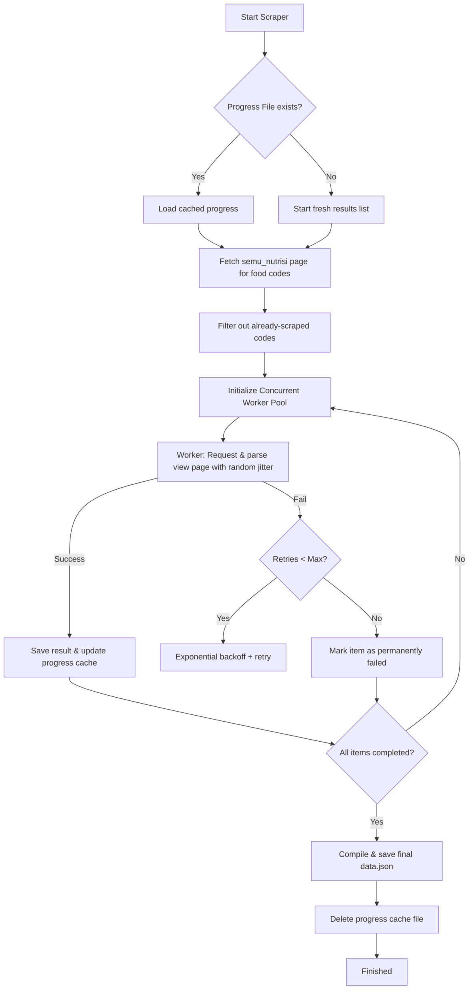

# 🥣 Panganku Scraper

[](https://opensource.org/licenses/MIT)
[](https://nodejs.org)
[](#tech-stack)
[](https://github.com/nichsedge/panganku-scraper/pulls)

A high-performance, resilient, and polite web scraper for [panganku.org](https://panganku.org) (the official Indonesian food nutrition database), built with Node.js. 

It is designed to cleanly fetch and parse the complete national database, yielding structured and normalized dataset output immediately ready for machine learning, statistical modeling, or application development.

---

## 📖 Table of Contents

1. [Key Features](#-key-features)
2. [Tech Stack](#-tech-stack)
3. [Architecture Overview](#-architecture-overview)
4. [Installation & Setup](#-installation--setup)
5. [Usage](#-usage)
6. [Data Schema & Dictionary](#-data-schema--dictionary)
7. [Configuration](#-configuration)
8. [License](#-license)

---

## ✨ Key Features

- ⚡ **High-Performance Concurrency**: Uses an asynchronous worker pool pattern to complete the sequential scraping of **1,146 food items in under 5 minutes** (down from several hours).
- 💾 **Resilient Session Checkpointing**: Automatically updates and saves incremental progress in a progress cache file (`panganku_progress.json`). If interrupted or terminated, it smoothly resumes exactly where it left off.
- 🧹 **Robust Data Normalization**: Cleans and parses raw Indonesian textual nutritional fields (e.g. `"1,147.1 mg"`, `"11.6 g"`, `"513 Kal"`) into clean floating-point or integer values (e.g., `1147.1`, `11.6`, `513`), making it directly readable by Pandas DataFrames (`pd.read_json`) or databases.
- 🛡️ **Polite Crawling Policies**: Employs exponential backoff retry algorithms with random delay jitter (100ms-400ms) to ensure polite access patterns, preventing IP blocks and server overload.
- 📊 **Elegant Real-time Terminal UI**: Renders real-time statistics in the console, including completed items count, percentage, success/failure rates, current item, and estimated time of arrival (ETA).

---

## 🛠️ Tech Stack

- **Runtime Environment**: [Node.js](https://nodejs.org/) (v16+)
- **HTTP Client**: [Axios](https://github.com/axios/axios) for robust HTTP requests with custom headers & timeouts.
- **HTML Parsing**: [Cheerio](https://cheerio.js.org/) for highly efficient, server-side jQuery-like selection.

---

## 📐 Architecture Overview



---

## 🚀 Installation & Setup

1. **Clone the Repository**:
   ```bash
   git clone https://github.com/nichsedge/panganku-scraper.git
   cd panganku-scraper
   ```

2. **Install Dependencies**:
   ```bash
   npm install
   ```

---

## 💻 Usage

### Start Scraping

To run the concurrent scraper and fetch all food items:
```bash
npm start
```

### Cleanup & Re-normalize Existing Data

If you have older scraped data containing raw strings and units, you can re-run normalization to ensure everything is converted to clean numbers:
```bash
npm run clean
```

---

## 📋 Data Schema & Dictionary

The scraped data is saved as a JSON array of objects in `data.json`. The dictionary below explains the keys and data formats:

### Metadata Fields (Strings)

| Field Name | Description | Source Tag | Example Value |
| :--- | :--- | :--- | :--- |
| `Kode` | Unique national food classification code | Kode | `GP054` |
| `Nama` | General food name in Indonesian | Nama | `Abon ikan` |
| `Nama Latin` | Scientific/Latin name (where applicable) | Nama Latin | `Nelumbo nucifera` |
| `Asal` | Regional origin of the food | Asal | `Kalimantan Selatan` |
| `Kategori` | Food category group | Kelompok | `Ikan/Kerang/Udang dll` |
| `Tipe Bahan` | State of food item (Mentah/Olahan) | Tipe | `Olahan (Processed)` |
| `Keterangan` | Additional descriptive notes | Deskripsi | `Abon dari ikan gabus` |
| `jumlah` | Base portion quantity | jumlah | `100 g` |

### Nutritional Fields (Clean Numeric Floats/Integers or `null` if empty)

| Field Name | Nutrient | Default Unit | Example Value |
| :--- | :--- | :--- | :--- |
| `BDD` | Berat Dapat Dimakan (Edible portion %) | `%` | `89` |
| `Water` | Water (Air) | `g` | `6.4` |
| `Energy` | Energy (Energi) | `kcal` / `Kal` | `435` |
| `Protein` | Protein | `g` | `27.2` |
| `Fat` | Total Fat (Lemak) | `g` | `20.2` |
| `CHO` | Carbohydrates (Karbohidrat) | `g` | `36.1` |
| `Fibre` | Total Dietary Fibre (Serat) | `g` | `2.7` |
| `ASH` | Mineral Ash (Abu) | `g` | `10.1` |
| `Ca` | Calcium (Kalsium) | `mg` | `25.0` |
| `P` | Phosphorus (Fosfor) | `mg` | `25.0` |
| `Fe` | Iron (Besi) | `mg` | `0.5` |
| `Na` | Sodium (Natrium) | `mg` | `61.0` |
| `K` | Potassium (Kalium) | `mg` | `1147.1` |
| `Cu` | Copper (Tembaga) | `mg` | `0.02` |
| `Zn` | Zinc (Seng) | `mg` | `0.2` |
| `Vit. A` | Vitamin A | `mcg` / `SI` | `12.0` |
| `Carotenes` | Total Carotenes (Karoten Total) | `mcg` | `83.0` |
| `Re` | Retinol | `mcg` | `90.0` |
| `Vit. B1` | Thiamine (Vitamin B1) | `mg` | `0.05` |
| `Vit. B2` | Riboflavin (Vitamin B2) | `mg` | `0.03` |
| `Niacin` | Niacin (Niasin) | `mg` | `1.9` |
| `Vit. C` | Vitamin C | `mg` | `2.0` |

---

## ⚙️ Configuration

You can easily adjust the scraping rates and tolerances directly at the top of [panganku.js](file:///home/al/Projects/panganku-scraper/panganku.js):

```javascript
const CONCURRENCY_LIMIT = 5; // Adjust simultaneous worker threads (default: 5)
const MAX_RETRIES = 3;       // Number of retries on network/server failures
```

---

## 📄 License

This project is licensed under the [MIT License](LICENSE).

